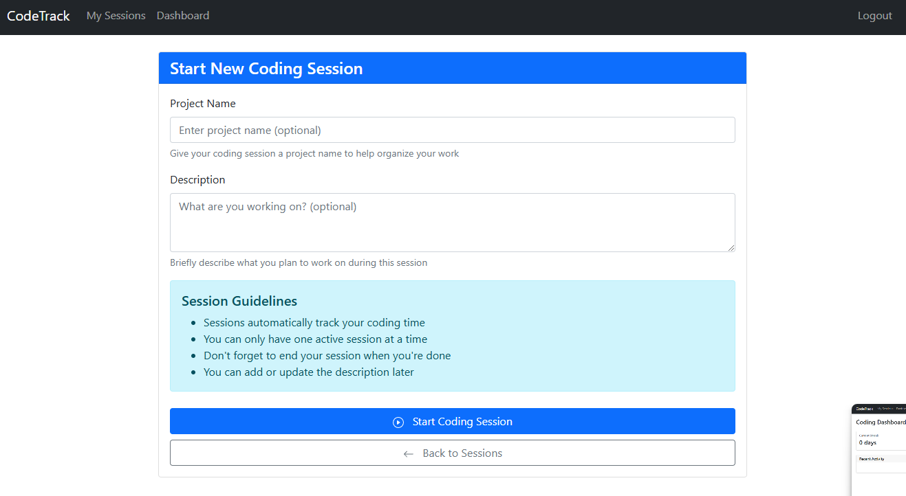

# CodeTrack - BIT Student Coding Time Tracker

A comprehensive web application designed to help BIT (Business Information Technology) students track, visualize, and analyze their coding sessions with detailed statistics.

## Screenshots

<div align="center">
  
  
</div>

<div align="center">
  
  
</div>

## Features

- **User Management**
  - Secure registration and authentication
  - Support for OAuth2 sign-in with Google
- **Time Tracking**

  - Start and end coding sessions
  - Track project names and descriptions
  - Automatic duration calculation

- **Comprehensive Dashboard**

  - View coding streak statistics
  - Daily, weekly, and monthly activity summaries
  - Project distribution visualization
  - Most productive hours analysis

- **Detailed Reports**
  - Filter sessions by date
  - Project-specific statistics
  - Exportable data (coming soon)

## Technical Stack

- **Backend**

  - Java with Spring Boot 3.3
  - Spring Security with OAuth2 support
  - JPA/Hibernate for database operations
  - Spring MVC for web layer

- **Frontend**

  - Thymeleaf templates
  - Bootstrap 5 for responsive design
  - JavaScript for enhanced interactions

- **Database**

  - H2 Database (development)
  - PostgreSQL (production, coming soon)

- **Tools & Libraries**
  - Maven for dependency management
  - Project Lombok for reducing boilerplate
  - Spring DevTools for development

## Getting Started

### Prerequisites

- JDK 17 or higher
- Maven 3.9+

### Running Locally

1. Clone the repository

   ```
   git clone https://github.com/yourusername/codetrack.git
   cd codetrack
   ```

2. Build the project

   ```
   ./mvnw clean install
   ```

3. Run the application

   ```
   ./mvnw spring-boot:run
   ```

4. Access the application at `http://localhost:8080`

### Configuration

- Default user credentials (dev mode):
  - Username: `admin`
  - Password: `admin123`

## Roadmap

- [ ] Mobile responsive enhancements
- [ ] Data export functionality
- [ ] Team coding session support
- [ ] Code editor integrations
- [ ] Gamification elements

## Contributing

Contributions are welcome! Feel free to fork the repository and submit pull requests.

## License

[MIT License](LICENSE)
